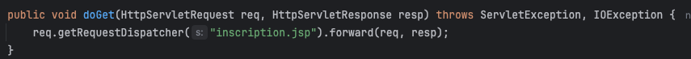

# TP4-J2EE
## Simonneau Robin, Pottier Loann, Landry Simon

## **Exercice 1**

## **Exercice 2**
### Partie 1: Inscription
Dans cette exercice il nous est demandé de créer un site de réservation d'appartement, qui doit stocker des réservations et des clients.  
Tout d'abord nous avons commencer par créer les beans qui corrrespondents au client et à la réservation, ces beans sont placé dans le packet **Model**.  
  
*Client.java*  
  
*Reservation.java*  

Ensuite nous avons créer les vues correspondantes à la page d'inscription, et l'affichages des informations de l'utilisateur.  

  
*inscription.jsp*  
  
*info_client.jsp*  
Les expressions de langages permettent de récupérer les informations que l'on passe dans la requête, comme **isError**, qui si est vrai alors affiche un message d'erreur.  
Dans _info_client.jsp_ on passe directement l'objet **Client** ce qui nous permet de récupérer la valeurs de ces attributs.  
  
Pour finir on créer le controller de l'inscription que l'on mets dans le package **Controller**.  
  
*CreateClient.java*  
Dans la méthode GET on renvoie la page d'inscriptions.  
  
*CreateClient.java*  
Dans la méthode POST, on récupère les infos envoyé par le formulaire, on vérifie si les champs ne sont ni vide ni incorrecte, si c'est le cas on renvoie l'utilisateur vers la page info_client avec le bean nouvellement créer en attribut, sinon on renvoie l'utilisateur sur la page des formulaire en précisant que il y a une erreur.  
Pour vérifier que les emails et numéros de téléphones sont correcte ont les passe dans un ReGeX.
  
*CreateClient.java*  

De cette façon on à mis en place l'inscription.  
On obtiens les vues suivantes.

### Partie 2: Réservation
